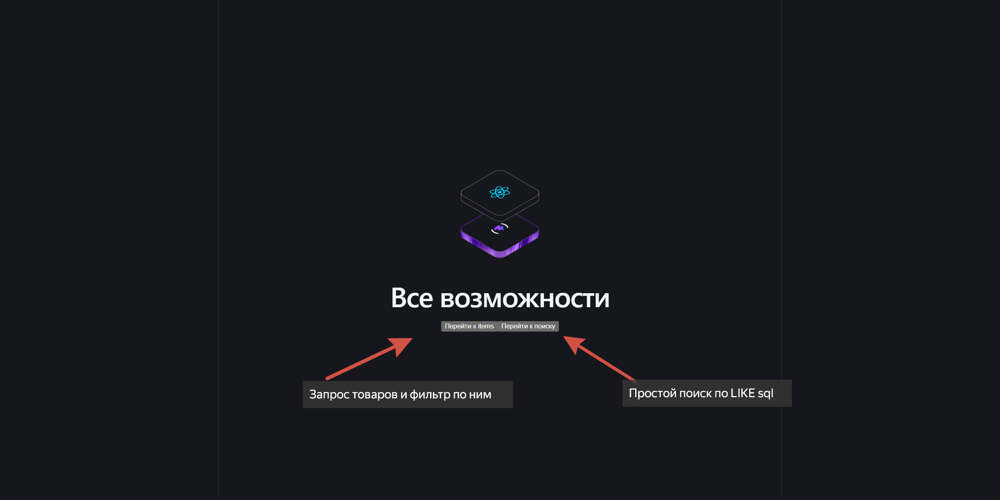

Стек технологий
 - PHP	8.4-fpm	
 - Symfony	
 - Doctrine 
 - PostgreSQL
 - Nginx
 - React
 - TypeScript 
 - Vite
 - SCSS
 - Docker Compose
 - Docker
 - Adminer

Запуск приложения

1. Клонируем проект 
2. В корне проекта есть `.env.example` в нем хранится тестовая информация для демонстрации работы проекта. В нем находятся все нужные переменные окружения для сборки контейнеров
Аналогичный же файл находится и в директории backend `backend/.env.example`. Он требуется для корректной работы симфони
Для теста работы их **оба** нужно переименовать на `.env` тогда все будет работать корректно. На выходе должен быть `.env` и `backend/.env` 
3. После указания переменных проект можно собрать `docker compose build` и дожидаемся полной сборки
4. Запускаем контейнеры `docker compose up`
5. Устанавливаем зависимости для бэка `docker exec -it php_symfony bash` затем `composer install`. Внутри нужно активировать миграции, что бы БД с товарами создалась `php bin/console doctrine:migrations:migrate` и подтвердить создание 
6. Устанавливаем зависимости для фронта `docker exec -it app_frontend sh` затем `npm install`
7. Сервер будет работать по стандарту на 1115 порте, если какие-то проблемы то можно переназначить переменную NGINX_PORT 
8. Если все успешно доступен по стандарту http://localhost:1115/
9. 